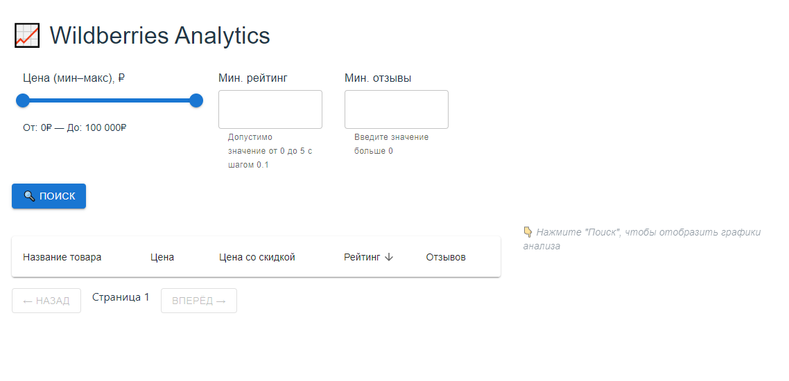
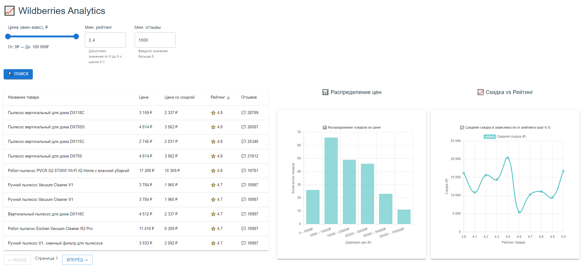

# 📈 Wildberries Analytics

Аналитическая платформа для сбора, хранения и визуализации информации о товарах с Wildberries.

### 🚀 Возможности:
- 📊 Гистограмма распределения цен по товарам
- 📈 Линейная зависимость скидки от рейтинга
- 🔍 Фильтрация по цене, рейтингу, количеству отзывов
- 📥 Парсинг товаров по поисковому запросу
- 📋 Таблица с сортировкой и пагинацией

---

## 📸 Скриншоты

Стартовая страница


Страница после загрузки товаров


---

## 🧰 Технологии

**Backend:**
- Python 3.9
- Django
- Django REST Framework (DRF)
- SQLite

**Frontend:**
- React + MUI
- Chart.js (react-chartjs-2)
- Axios
---

## ⚙️ Установка и запуск

```bash
1. git clone git@github.com:Faithdev21/wb-analytics.git
2. cd wb-analytics
3. touch .env
```
4. В файл .env вставить 

```
DEBUG=False
DJANGO_SECRET_KEY=django-secret
VITE_API_BASE_URL=http://localhost:8000/api
ALLOWED_HOSTS=127.0.0.1,localhost,backend
```
5. Установите зависимости из директории backend/:

```bash
python -m venv venv
```
```bash
pip install -r requirements.txt
```

6. Запустить миграции из директории backend/wildberries::

```bash
python manage.py makemigrations
python manage.py migrate
```

7. Выполнить парсинг товаров (Смотрите пункт 📡 Парсинг товаров с Wildberries)  


8. Запустить Django приложение из директории backend/wildberries:
```
python manage.py runserver
```

9. Запустить React приложение из директории frontend/:

```
npm run dev
```

После запуска откройте веб приложение:

- 🌐 WebApp: [http://localhost:5173](http://localhost:5173)
---

## 📡 Парсинг товаров с Wildberries

Запустить парсинг по ключевому слову из директории backend/wildberries:

```bash
python manage.py parse_wb --keyword="КАТЕГОРИЯ ТОВАРА"
```

Товары сохраняются в базу данных с полями:
- Название
- Цена и цена со скидкой
- Рейтинг
- Кол-во отзывов

---

## 🎨 Фильтрация и визуализация

Фронтенд позволяет:

- Выбрать минимальную цену, рейтинг, количество отзывов (по умолчанию до 100 000 рублей, минимальный рейтинг 0, минимальное количество отзывов 0)
- Отфильтровать таблицу и обновить данные
- Построить графики:
  - **Гистограмма по цене**
  - **Линейный график скидка vs рейтинг**

---

## 🔗 API

Пример запроса:

```
GET /api/products/?min_price=1000&min_rating=4.2&min_reviews=50
```

### Пример JSON:

```json
{
    "count": 1493,
    "next": "http://localhost:8000/api/products/?min_price=1000&min_rating=4.2&min_reviews=50&page=2",
    "previous": null,
    "results": [
        {
            "id": 919,
            "wb_id": 34939243,
            "name": "Пылесос вертикальный для дома DX118C",
            "price": 3159.0,
            "discount_price": 2337.0,
            "rating": 4.8,
            "review_count": 28769
        },
...
      
}
```
---
